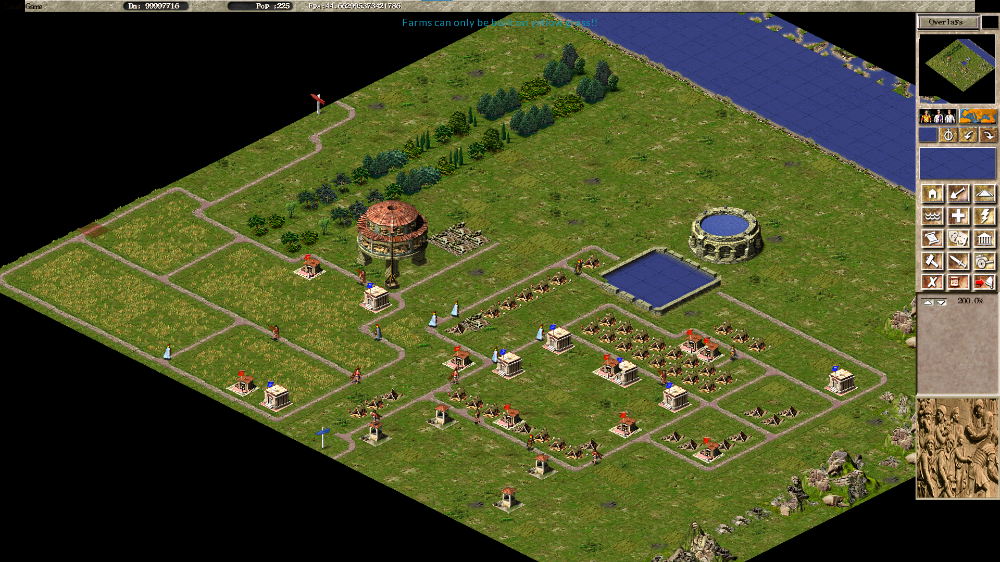

# Projet PYSAR de programmation python 3A INSA

Pysar est un jeu de city building inspiré de la civilisation romaine antique, et qui est basé sur le jeu `Caesar III`. Son implémentation doit respecter les mécanismes du jeu Caesar3. 
Le but du jeu est de construire une ville fonctionnelle à partir d’un terrain vide (mais parsemé d’obstacles et de végétations). Le jeu est divisé en nivaux qui correspondent 
à des missions. Chaque niveau impose de satisfaire les critères suivants : 

- Critère 1 : Favor 
- Critère 2 : Population 
- Critère 3 : Health and education 
- Critère 4 : Peace rate 

**Fonctionnalités** 
- Map en 2.5D
- Menus utilisateur
- Gestion de bâtiments
- Gestion de walkers
- Gestion du multijoueur

Additionnellement, le jeu a été mis en réseau pour offrir une fonctionnalité `multijoueur`. La mise en réseau est de type `Peer-To-Peer (P2P)` sans serveur central, et a été implémentée
en langage C.

## Notes

Le projet PYSAR a été implémenté pour tourner sous la version 3.10 de python ; toute rétrocompatibilité est impossible et la post compatibilité n’a pas été prévue. 
Il a été implémenté conformément au jeu original `Caesar3`, au moyen de la librairie graphique `Arcade`. Leu jeu peut être lancé sur un système `Windows` ou un système `Linux`.

## Requirements

- Python 3.10
- pyautogui 
- arcade
- pathfinding
- pyglet 
